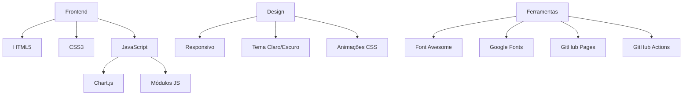

# Portfólio de Ciência de Dados - Julio Cesar Okuda

[](https://jcnok.github.io/portfolio/)
[](https://linkedin.com/in/juliookuda)
[](https://opensource.org/licenses/MIT)
[](https://html.spec.whatwg.org/)
[](https://www.w3.org/Style/CSS/)
[](https://developer.mozilla.org/en-US/docs/Web/JavaScript)

## 📋 Índice

- [Portfólio de Ciência de Dados - Julio Cesar Okuda](#portfólio-de-ciência-de-dados---julio-cesar-okuda)
  - [📋 Índice](#-índice)
  - [📊 Visão Geral](#-visão-geral)
  - [🚀 Tecnologias Utilizadas](#-tecnologias-utilizadas)
  - [🔍 Funcionalidades](#-funcionalidades)
  - [🏗️ Arquitetura do Projeto](#️-arquitetura-do-projeto)
  - [🛠️ Estrutura do Projeto](#️-estrutura-do-projeto)
  - [📋 Pré-requisitos](#-pré-requisitos)
  - [🚀 Como Executar Localmente](#-como-executar-localmente)
  - [📱 Responsividade](#-responsividade)
  - [🔄 Integração Contínua](#-integração-contínua)
  - [🧩 Padrões de Projeto Aplicados](#-padrões-de-projeto-aplicados)
  - [📝 Boas Práticas Implementadas](#-boas-práticas-implementadas)
  - [🔍 SEO e Acessibilidade](#-seo-e-acessibilidade)
  - [🔮 Próximos Passos](#-próximos-passos)
  - [📞 Contato](#-contato)
  - [📄 Licença](#-licença)

## 📊 Visão Geral

Portfólio profissional destacando minha experiência e projetos em Ciência de Dados, Machine Learning e Cloud Computing. Este site foi desenvolvido para apresentar meu trabalho de forma interativa e acessível, com design moderno e suporte para modo escuro.

O objetivo principal é demonstrar minhas habilidades técnicas, projetos realizados e certificações obtidas na área de Data Science, proporcionando uma experiência de usuário agradável e informativa.

## 🚀 Tecnologias Utilizadas



- **Frontend**:
  - HTML5 - Estruturação semântica do conteúdo
  - CSS3 - Estilização avançada com variáveis CSS e animações
  - JavaScript - Interatividade e manipulação do DOM
  
- **Visualização de Dados**:
  - Chart.js - Criação de gráficos interativos

- **Bibliotecas**:
  - Font Awesome - Ícones vetoriais
  - Google Fonts (Inter) - Tipografia

- **Hospedagem e Implantação**:
  - GitHub Pages - Hospedagem estática
  - GitHub Actions - Integração contínua

## 🔍 Funcionalidades

- **Design Moderno**: Interface limpa e contemporânea com animações sutis
- **Modo Escuro/Claro**: Alternância de tema com persistência de preferência do usuário
- **Seção Sobre**: Informações profissionais, acadêmicas e estatísticas do GitHub
- **Habilidades**: Visualização interativa de competências técnicas com gráfico radar
- **Projetos**: Galeria de projetos com filtros por categoria (Análise de Dados, Machine Learning, Cloud)
- **Certificações**: Exibição de certificações profissionais com logos e descrições
- **Contato**: Formulário para mensagens e links para redes sociais
- **Responsivo**: Adaptado para todos os tamanhos de tela (mobile, tablet, desktop)
- **Animações**: Elementos animados ao scroll para melhor engajamento
- **Acessibilidade**: Implementação de práticas de acessibilidade para inclusão

## 🏗️ Arquitetura do Projeto



```mermaid title="Arquitetura do Projeto" type="diagram"
graph TD;
    A["index.html"]-->B["assets/css/styles.css"]
    A-->C["assets/js/main.js"]
    A-->D["assets/js/theme-toggle.js"]
    A-->E["assets/js/projects.js"]
    A-->F["assets/js/skills-chart.js"]
    G["Componentes"]-->H["Header & Navigation"]
    G-->I["Hero Section"]
    G-->J["About Section"]
    G-->K["Skills Section"]
    G-->L["Projects Section"]
    G-->M["Certifications Section"]
    G-->N["Contact Section"]
    G-->O["Footer"]
    P["Funcionalidades JS"]-->Q["Theme Toggle"]
    P-->R["Project Filtering"]
    P-->S["Skills Chart"]
    P-->T["Mobile Navigation"]
    P-->U["Form Handling"]
    P-->V["Smooth Scrolling"]
```

O projeto segue uma arquitetura modular, com separação clara entre:

1. **Estrutura (HTML)**: Organização semântica do conteúdo
2. **Apresentação (CSS)**: Estilização e responsividade
3. **Comportamento (JS)**: Interatividade e funcionalidades dinâmicas

Cada módulo JavaScript é responsável por uma funcionalidade específica, seguindo o princípio de responsabilidade única.

## 🛠️ Estrutura do Projeto

```
portfolio/
├── assets/
│   ├── css/
│   │   └── styles.css              # Estilos principais
│   ├── js/
│   │   ├── main.js                 # Funcionalidades principais
│   │   ├── theme-toggle.js         # Alternância de tema
│   │   ├── projects.js             # Gerenciamento de projetos
│   │   └── skills-chart.js         # Gráfico de habilidades
│   └── images/
│       ├── badges/                 # Imagens de certificações
│       │   ├── aws-certified-cloud-practitioner-badge.png
│       │   ├── microsoft-certified-associate-badge.png
│       │   └── microsoft-certified-fundamentals-badge.png
│       ├── icons/
│       │   └── favicon.ico
│       ├── profile/
│       │   └── profile.jpg
│       └── projects/               # Imagens dos projetos
│           ├── data-analysis.png
│           ├── machine-learning.png
│           ├── cloud-computing.png
│           ├── dashboard.png
│           ├── deep-learning.png
│           └── azure.png
├── index.html                      # Página principal
├── 404.html                        # Página de erro
└── README.md                       # Documentação
```

## 📋 Pré-requisitos

- Navegador web moderno (Chrome, Firefox, Safari, Edge)
- Conexão com internet para carregar fontes e ícones

## 🚀 Como Executar Localmente

1. Clone este repositório:
   ```bash
   git clone https://github.com/Jcnok/portfolio.git
   ```

2. Navegue até o diretório do projeto:
   ```bash
   cd portfolio
   ```

3. Abra o arquivo `index.html` em seu navegador ou utilize um servidor local:
   ```bash
   # Usando Python
   python -m http.server 8000
   
   # Usando Node.js
   npx serve
   ```

4. Acesse o site em `http://localhost:8000` (ou a porta indicada pelo servidor)

## 📱 Responsividade

O site é totalmente responsivo e otimizado para:

- **Desktops** (1200px+)
- **Laptops** (992px - 1199px)
- **Tablets** (768px - 991px)
- **Smartphones** (320px - 767px)

A responsividade é implementada usando:
- Media queries
- Unidades relativas (rem, %, vh/vw)
- Flexbox e Grid para layouts adaptáveis
- Imagens responsivas

## 🔄 Integração Contínua

Este projeto utiliza GitHub Actions para implementação contínua no GitHub Pages:

```yaml
name: Deploy to GitHub Pages

on:
  push:
    branches: [ main ]
  workflow_dispatch:

permissions:
  contents: write

jobs:
  deploy:
    runs-on: ubuntu-latest
    steps:
      - name: Checkout 🛎️
        uses: actions/checkout@v3
      
      - name: Setup Node.js
        uses: actions/setup-node@v3
        with:
          node-version: '16'
      
      - name: Install Dependencies
        run: |
          if [ -f package.json ]; then
            npm ci
          fi
      
      - name: Build
        run: |
          if [ -f package.json ]; then
            npm run build
          fi
      
      - name: Deploy 🚀
        uses: JamesIves/github-pages-deploy-action@v4
        with:
          folder: .
          branch: gh-pages
```

## 🧩 Padrões de Projeto Aplicados

- **Module Pattern**: Encapsulamento de funcionalidades em módulos JavaScript
- **Namespace Pattern**: Evita poluição do escopo global
- **Revealing Module Pattern**: Expõe apenas as funcionalidades necessárias
- **Observer Pattern**: Para eventos e comunicação entre componentes
- **Factory Pattern**: Criação de elementos DOM
- **Singleton Pattern**: Instâncias únicas para gerenciadores (ex: ThemeManager)

## 📝 Boas Práticas Implementadas

- **Código Limpo**: Nomes descritivos, funções pequenas, comentários úteis
- **Semântica HTML**: Uso apropriado de tags semânticas (header, nav, section, etc.)
- **CSS Modular**: Variáveis CSS para temas e reutilização
- **JavaScript Modular**: Separação de responsabilidades
- **Performance**: Otimização de imagens, carregamento eficiente
- **Versionamento**: Controle de versão com Git
- **Documentação**: Comentários de código e README detalhado

## 🔍 SEO e Acessibilidade

- **Meta Tags**: Descrição, palavras-chave, autor
- **Semântica**: Estrutura HTML semântica para melhor indexação
- **Acessibilidade**: Atributos ARIA, contraste adequado, navegação por teclado
- **Performance**: Otimização para melhor ranqueamento
- **Responsividade**: Adaptação para todos os dispositivos

## 🔮 Próximos Passos

- [ ] Implementar PWA (Progressive Web App)
- [ ] Adicionar blog com artigos técnicos
- [ ] Integrar Google Analytics
- [ ] Implementar internacionalização (i18n)
- [ ] Adicionar mais projetos e categorias
- [ ] Melhorar acessibilidade (WCAG 2.1 AA)
- [ ] Otimizar performance (Core Web Vitals)
- [ ] Adicionar testes automatizados

## 📞 Contato

- **GitHub**: [Jcnok](https://github.com/Jcnok)
- **LinkedIn**: [juliookuda](https://linkedin.com/in/juliookuda)
- **Email**: juliookuda@email.com
- **Website**: [jcnok.github.io/portfolio](https://jcnok.github.io/portfolio/)

## 📄 Licença

Este projeto está licenciado sob a licença MIT - veja o arquivo [LICENSE](LICENSE) para detalhes.

---

Desenvolvido com ❤️ por Julio Cesar Okuda com IA v0
