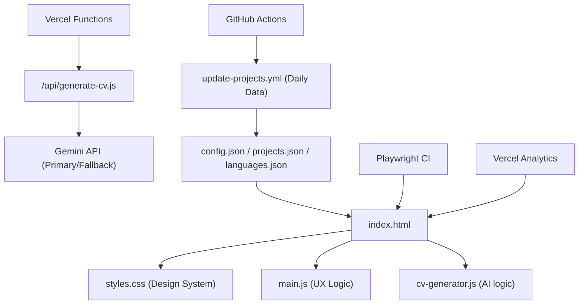

<div align="center">

# 🚀 Julio Okuda — AI Automation Portfolio

### *"E se o próprio portfólio fosse a prova de que eu domino IA?"*

<br>

<!-- 👇 Substitua pelo GIF do site em funcionamento -->


<br>

[](https://portfolio-jcnok.vercel.app/)

<br>

[](https://vercel.com/new/clone?repository-url=https%3A%2F%2Fgithub.com%2FJcnok%2Fportfolio)
[](https://linkedin.com/in/juliookuda)
[](https://opensource.org/licenses/MIT)
[](https://html.spec.whatwg.org/)
[](https://www.w3.org/Style/CSS/)
[](https://developer.mozilla.org/en-US/docs/Web/JavaScript)
[](https://ai.google.dev/)

</div>

---

## 📋 Índice

- [A História por Trás](#-a-história-por-trás)
- [Funcionalidades](#-funcionalidades)
- [Destaque: Gerador de Currículo IA (ATS)](#-destaque-gerador-de-currículo-ia-ats)
- [Arquitetura do Projeto](#️-arquitetura-do-projeto)
- [Stack Tecnológico](#-stack-tecnológico)
- [Estrutura de Arquivos](#-estrutura-de-arquivos)
- [Como Executar Localmente](#-como-executar-localmente)
- [Qualidade e Testes](#-qualidade-e-testes)
- [Pipeline de Automação](#-pipeline-de-automação)
- [Padrões de Engenharia](#-padrões-de-engenharia)
- [Roadmap](#-roadmap)
- [Contato](#-contato)
- [Licença](#-licença)

---

## 💡 A História por Trás

> *A maioria dos portfólios são vitrines. Este é uma plataforma de engenharia viva.*

Eu poderia ter feito o que todo mundo faz: uma página bonita com cards de projetos e um botão "Baixar CV". Mas isso não reflete quem eu sou.

Sou um profissional em **transição de carreira para IA e Automação**, e meu portfólio precisava responder uma pergunta simples: **"Ele realmente sabe fazer o que diz?"**

A resposta está na própria experiência de navegação:

- O **Chat com IA** responde perguntas sobre mim usando a API do Gemini — com sanitização contra XSS e Rate Limiting.
- O **Gráfico de Habilidades** é gerado automaticamente a partir dos meus repositórios do GitHub via pipeline diária.
- O **Gerador de Currículo ATS** analisa vagas em tempo real e monta um dossiê personalizado cruzando com meus dados reais.
- **Engenharia de Conversão**: O site monitora engajamento (Vercel Analytics) e facilita o agendamento direto via Calendly/WhatsApp.

Cada feature deste site é uma **demonstração técnica viva** das habilidades que eu listo no meu currículo. Não é buzzword — é código em produção, testado e monitorado.

---

## ✨ Funcionalidades

| Feature | Descrição | Tech |
|---|---|---|
| 🤖 **Gerador de CV ATS** | Analisa vagas e gera Relatório + Currículo + Carta em `.doc` | Gemini 2.5 Flash + Fallback |
| 📊 **Skills Dinâmicas** | Gráfico radar gerado via pipeline GitHub Actions + Gemini | Chart.js, GitHub API |
| 💬 **Chat com IA** | Assistente que responde sobre meu perfil usando Gemini API | Gemini API, Vercel Functions |
| 📈 **Telemetria de Leads** | Monitoramento de cliques e conversão em tempo real | Vercel Analytics |
| 🎯 **CTA de Conversão** | Agendamento via Calendly e WhatsApp integrados | Headless JSON Config |
| ✨ **UX Nudges** | Micro-animações (Pulse) que ativam após scroll estratégico | JS Interaction Observer |
| 📱 **Mobile-First** | 100% responsivo com tipografia fluida (`clamp`) | CSS Grid, Clamp Logic |
| 🧪 **Blindagem Técnica** | Testes Unitários (Jest) e End-to-End (Playwright) | Jest, Playwright |

---

## 🤖 Destaque: Gerador de Currículo IA (ATS)

> *"Recrutador, em vez de entregar um PDF genérico, construí um agente que monta o currículo sob medida para a SUA vaga."*

Esta é a feature que diferencia este portfólio. O sistema funciona assim:

```
┌──────────────┐     ┌──────────────────┐     ┌──────────────────────┐
│  Recrutador  │────▶│  Cole a Vaga no  │────▶│  Gemini 2.5 Flash    │
│  (Browser)   │     │  Modal do Site   │     │  (Temperature = 0)   │
└──────────────┘     └──────────────────┘     └──────────┬───────────┘
                                                         │
                                               ┌──────────▼───────────┐
                                               │  Fallback Automático │
                                               │  Gemini 3.1 Lite     │
                                               └──────────┬───────────┘
                                                         │
                      ┌───────────────────────────────────▼─┐
                      │         3 Outputs Separados          │
                      │                                      │
                      │  📊 Relatório de Compatibilidade     │
                      │  📄 Currículo ATS (.doc)             │
                      │  ✉️  Carta de Apresentação (.doc)     │
                      └──────────────────────────────────────┘
```

### Características Técnicas:
- **Zero-Hallucination**: Perfil embutido estaticamente no System Prompt.
- **Dual-Model Fallback**: Migração automática entre modelos se atingir Rate Limits.
- **Exportação Nativa**: Arquivos `.doc` gerados via Blob com wrapper XML do MS Office.

---

## 🏗️ Arquitetura do Projeto


```mermaid
graph TD;
    A["index.html"]-->B["styles.css (Design System)"]
    A-->C["main.js (UX Logic)"]
    A-->H["cv-generator.js (AI logic)"]

    I["Vercel Functions"]-->K["/api/generate-cv.js"]
    K-->P["Gemini API (Primary/Fallback)"]

    L["GitHub Actions"]-->M["update-projects.yml (Daily Data)"]
    M-->O["config.json / projects.json / languages.json"]
    O-->A

    R["Playwright CI"]-->A
    S["Vercel Analytics"]-->A
```

---

## 🔧 Stack Tecnológico

| Camada | Tecnologias |
|---|---|
| **Frontend** | HTML5 Semântico, Vanilla CSS (Design Tokens), Vanilla JS ES6+ |
| **Inteligência** | Google Gemini (Multi-model), Vercel Serverless Functions |
| **Qualidade** | Playwright (E2E), Jest (Unit), GitHub Actions (CI) |
| **Observabilidade** | Vercel Analytics (Event Tracking) |
| **Automação** | JavaScript (Scripts de Enriquecimento de Dados), n8n (External) |

---

## 📁 Estrutura de Arquivos Principal

- `api/`: Funções serverless para Chat e Geração de CV.
- `assets/data/`: **Headless CMS** (todos os dados do site em JSON).
- `assets/js/`: Módulos independentes por funcionalidade.
- `docs/`: Documentação de PRD, Design System e Epics.
- `tests/`: Suíte de testes automatizados.

---

## 🚀 Como Executar Localmente

### Testando o Frontend
```bash
npm install
npx serve .
```

### Rodando o Ambiente de Testes
```bash
# Testes Unitários (Lógica de Dados)
npm test

# Testes E2E (Fluxo de Conversão no Browser)
npx playwright install
npx playwright test
```

---

## 🧪 Qualidade e Testes (Quality Gates)

Para garantir que a experiência do recrutador seja sempre perfeita, implementamos:
1. **Jest**: Valida a lógica de filtragem de projetos e manipulação de dados JSON.
2. **Playwright**: Simula um usuário real navegando no site, abrindo o modal de IA e clicando nos CTAs de contato.
3. **CI Pipeline**: Bloqueia o deploy caso qualquer teste quebre, mantendo a integridade 100% do tempo.

---

## 🔮 Roadmap

- [x] Chat com IA (Gemini)
- [x] Pipeline automática de Skills (GitHub Actions)
- [x] Gerador de Currículo ATS com Dual-LLM
- [x] Engenharia de Conversão (Analytics + CTAs links)
- [x] Testes E2E (Playwright)
- [x] Headless Config (Centralizado em JSON)
- [ ] Blog integrado com IA
- [ ] Internacionalização (EN/PT)
- [ ] Progressive Web App (PWA)

---

## 📞 Contato

<div align="center">

| Canal | Link |
|---|---|
| 💼 **LinkedIn** | [linkedin.com/in/juliookuda](https://linkedin.com/in/juliookuda) |
| 📅 **Agendar Café** | [Calendly](https://calendly.com/jcnok) |
| 📧 **Email** | [julio.okuda@gmail.com](mailto:julio.okuda@gmail.com) |
| 🌐 **Vivo** | [portfolio-jcnok.vercel.app](https://portfolio-jcnok.vercel.app/) |

</div>

---

<div align="center">

**Desenvolvido com ❤️ e IA por [Julio Cesar Okuda](https://github.com/Jcnok)**

*"Não é apenas um portfólio. É a prova de conceito do seu próximo projeto."*

</div>
