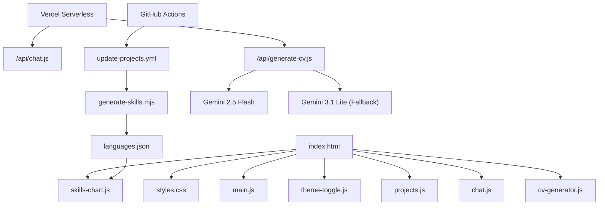

<div align="center">

# 🚀 Julio Okuda — AI Automation Portfolio

### *"E se o próprio portfólio fosse a prova de que eu domino IA?"*

<br>

<!-- 👇 Substitua pelo GIF do site em funcionamento -->


<br>

[](https://portfolio-jcnok.vercel.app/)

<br>

[](https://vercel.com/new/clone?repository-url=https%3A%2F%2Fgithub.com%2FJcnok%2Fportfolio)
[](https://linkedin.com/in/juliookuda)
[](https://opensource.org/licenses/MIT)
[](https://html.spec.whatwg.org/)
[](https://www.w3.org/Style/CSS/)
[](https://developer.mozilla.org/en-US/docs/Web/JavaScript)
[](https://ai.google.dev/)

</div>

---

## 📋 Índice

- [A História por Trás](#-a-história-por-trás)
- [Funcionalidades](#-funcionalidades)
- [Destaque: Gerador de Currículo IA (ATS)](#-destaque-gerador-de-currículo-ia-ats)
- [Arquitetura do Projeto](#️-arquitetura-do-projeto)
- [Stack Tecnológico](#-stack-tecnológico)
- [Estrutura de Arquivos](#-estrutura-de-arquivos)
- [Como Executar Localmente](#-como-executar-localmente)
- [Deploy na Vercel](#️-deploy-na-vercel)
- [Pipeline de Automação](#-pipeline-de-automação)
- [Padrões de Engenharia](#-padrões-de-engenharia)
- [Roadmap](#-roadmap)
- [Contato](#-contato)
- [Licença](#-licença)

---

## 💡 A História por Trás

> *A maioria dos portfólios são vitrines. Este é uma fábrica.*

Eu poderia ter feito o que todo mundo faz: uma página bonita com cards de projetos e um botão "Baixar CV". Mas isso não reflete quem eu sou.

Sou um profissional em **transição de carreira para IA e Automação**, e meu portfólio precisava responder uma pergunta simples: **"Ele realmente sabe fazer o que diz?"**

A resposta está na própria experiência de navegação:

- O **Chat com IA** responde perguntas sobre mim usando a API do Gemini — com sanitização contra XSS e Rate Limiting.
- O **Gráfico de Habilidades** é gerado automaticamente a partir dos meus repositórios do GitHub via pipeline diária.
- O **Gerador de Currículo ATS** analisa vagas em tempo real e monta um dossiê personalizado cruzando com meus dados reais.

Cada feature deste site é uma **demonstração técnica viva** das habilidades que eu listo no meu currículo. Não é buzzword — é código em produção.

---

## ✨ Funcionalidades

| Feature | Descrição | Tech |
|---|---|---|
| 🌗 **Tema Dark/Light** | Alternância com persistência via `localStorage` e `MutationObserver` no Chart.js | CSS Variables, JS |
| 💬 **Chat com IA** | Assistente que responde sobre meu perfil usando Gemini API com sanitização DOM | Gemini API, Vercel Functions |
| 📊 **Skills Dinâmicas** | Gráfico radar gerado automaticamente via pipeline GitHub Actions + Gemini | Chart.js, GitHub API |
| 🎯 **Filtro de Projetos** | Filtragem por categorias (`ai-automation`, `data-analysis`, `ml`, `web-dev`) | Vanilla JS, JSON |
| 🤖 **Gerador de CV ATS** | Analisa vagas e gera Relatório + Currículo + Carta em `.doc` | Gemini 2.5 Flash + Fallback |
| 📱 **Mobile-First** | 100% responsivo com breakpoints otimizados (320px → 1200px+) | CSS Grid, Flexbox |
| ♿ **Acessibilidade** | Skip-to-content, ARIA labels, contraste WCAG AA | HTML5 Semântico |
| 📬 **Formulário Real** | Envio de mensagens via FormSubmit.co (AJAX, sem backend) | REST API |

---

## 🤖 Destaque: Gerador de Currículo IA (ATS)

> *"Recrutador, sei que seu tempo é valioso. Em vez de entregar um PDF genérico, construí um agente que monta o currículo sob medida para a SUA vaga."*

Esta é a feature que diferencia este portfólio de qualquer outro. O sistema funciona assim:

```
┌──────────────┐     ┌──────────────────┐     ┌──────────────────────┐
│  Recrutador  │────▶│  Cole a Vaga no  │────▶│  Gemini 2.5 Flash    │
│  (Browser)   │     │  Modal do Site   │     │  (Temperature = 0)   │
└──────────────┘     └──────────────────┘     └──────────┬───────────┘
                                                         │
                                              ┌──────────▼───────────┐
                                              │  Fallback Automático │
                                              │  Gemini 3.1 Lite     │
                                              └──────────┬───────────┘
                                                         │
                     ┌───────────────────────────────────▼─┐
                     │         3 Outputs Separados          │
                     │                                      │
                     │  📊 Relatório de Compatibilidade     │
                     │  📄 Currículo ATS (.doc)             │
                     │  ✉️  Carta de Apresentação (.doc)     │
                     └──────────────────────────────────────┘
```

### Características Técnicas:
- **Zero-Hallucination Grounding**: O perfil é embutido estaticamente no System Prompt. A IA nunca inventa dados.
- **Dual-Model Fallback**: Se o Gemini 2.5 Flash atingir o Rate Limit (20 RPD), o sistema migra automaticamente para o Gemini 3.1 Flash Lite (500 RPD).
- **Humanized Error State**: Se ambos os modelos estiverem indisponíveis, o recrutador recebe uma mensagem amigável com links diretos de contato — nunca um `alert()` seco.
- **Exportação .doc**: Os arquivos são gerados via Blob com wrapper `xmlns:w` do MS Office, abrindo formatados nativamente no Word.

---

## 🏗️ Arquitetura do Projeto


```mermaid
graph TD;
    A["index.html"]-->B["styles.css"]
    A-->C["main.js"]
    A-->D["theme-toggle.js"]
    A-->E["projects.js"]
    A-->F["skills-chart.js"]
    A-->G["chat.js"]
    A-->H["cv-generator.js"]

    I["Vercel Serverless"]-->J["/api/chat.js"]
    I-->K["/api/generate-cv.js"]

    L["GitHub Actions"]-->M["update-projects.yml"]
    M-->N["generate-skills.mjs"]
    N-->O["languages.json"]
    O-->F

    K-->P["Gemini 2.5 Flash"]
    K-->Q["Gemini 3.1 Lite (Fallback)"]
```

O projeto segue uma arquitetura **modular e data-driven**:

1. **Frontend**: HTML5 semântico + CSS com Design Tokens (variáveis) + JS modular (1 arquivo por feature)
2. **Backend**: Vercel Serverless Functions (API de Chat + Gerador de CV)
3. **Pipeline**: GitHub Actions diário que atualiza projetos e habilidades via GitHub API + Gemini

---

## 🔧 Stack Tecnológico

| Camada | Tecnologias |
|---|---|
| **Frontend** | HTML5, CSS3 (Vanilla), JavaScript ES6+ |
| **Visualização** | Chart.js (Radar Chart) |
| **IA / LLM** | Google Gemini 2.5 Flash + 3.1 Flash Lite |
| **Backend** | Vercel Serverless Functions (Node.js) |
| **CI/CD** | GitHub Actions (Pipeline diário de dados) |
| **Hosting** | Vercel (Deploy automático via Git) |
| **Formulário** | FormSubmit.co (AJAX) |

---

## 📁 Estrutura de Arquivos

```
portfolio/
├── api/
│   ├── chat.js                      # Endpoint IA do Chat (Gemini)
│   └── generate-cv.js               # Endpoint Gerador de CV ATS (Dual-Model)
├── assets/
│   ├── css/
│   │   └── styles.css               # Design System (variáveis + componentes)
│   ├── data/
│   │   ├── projects.json            # Dados dos projetos (fonte única de verdade)
│   │   ├── languages.json           # Skills geradas via pipeline GitHub
│   │   └── curriculo-default/       # Currículo base para grounding da IA
│   │       └── Curriculo_JULIO_OKUDA.md
│   ├── js/
│   │   ├── main.js                  # Navegação, formulário, animações
│   │   ├── theme-toggle.js          # Dark/Light mode
│   │   ├── projects.js              # Fetch + filtro de projetos
│   │   ├── skills-chart.js          # Radar chart dinâmico
│   │   ├── chat.js                  # Widget de chat com IA
│   │   └── cv-generator.js          # Modal + split + download .doc
│   └── images/                      # Badges, profile, project covers
├── scripts/
│   └── generate-skills.mjs          # Script de pipeline (GitHub API → Gemini → JSON)
├── docs/
│   └── prd.md                       # PRD completo com 6 Epics e 15+ Stories
├── tests/
│   └── projects.test.js             # Testes unitários (Jest)
├── index.html                       # Página principal
├── 404.html                         # Página de erro customizada
└── README.md                        # Você está aqui 📍
```

---

## 🚀 Como Executar Localmente

### Pré-requisitos
- **Node.js** (v18+)
- **Chave de API do Gemini** ([Obter aqui](https://aistudio.google.com/apikey))

### Passo a Passo

```bash
# 1. Clone o repositório
git clone https://github.com/Jcnok/portfolio.git
cd portfolio

# 2. Instale as dependências
npm install

# 3. Configure o ambiente
cp .env.example .env
# Edite o .env e adicione sua GEMINI_API_KEY

# 4. Execute com Vercel CLI (recomendado, para testar APIs)
npx vercel dev

# 5. Ou apenas o frontend estático
npx serve .
```

### Rodando os Testes
```bash
npm test
```

---

## ☁️ Deploy na Vercel

> ⚠️ Este projeto **requer** a Vercel (ou host com suporte a Serverless Functions) para que o Chat e o Gerador de CV funcionem.

1. Crie uma conta na [Vercel](https://vercel.com)
2. Importe este repositório
3. Adicione a variável de ambiente:
   - `GEMINI_API_KEY`: Sua chave da API do Google Gemini
4. Deploy automático a cada push na `main` ✅

---

## ⚙️ Pipeline de Automação

O portfólio possui um **GitHub Actions Workflow** (`update-projects.yml`) que executa diariamente:

```
GitHub API  →  Fetch Repos  →  Gemini API  →  Categorização  →  projects.json + languages.json
```

- Busca repositórios públicos e pinados do perfil `Jcnok`
- Extrai linguagens e estatísticas de uso
- Usa Gemini para categorizar projetos e gerar resumos
- Atualiza os JSONs e faz auto-commit

---

## 🧩 Padrões de Engenharia

| Padrão | Aplicação |
|---|---|
| **Module Pattern** | Cada JS encapsula uma funcionalidade |
| **Singleton** | `ThemeManager`, `ProjectManager` |
| **Observer** | `MutationObserver` para troca de tema no Chart.js |
| **Factory** | Criação dinâmica de cards de projeto |
| **Data-Driven** | Projetos e skills vêm de JSON, não de HTML hardcoded |
| **Fallback Strategy** | Multi-model LLM com degradação graciosa |
| **Defensive Coding** | Sanitização XSS, fallbacks de campo, rate limiting |

---

## 🔮 Roadmap

- [x] Chat com IA (Gemini)
- [x] Pipeline automática de Skills (GitHub Actions)
- [x] Gerador de Currículo ATS com Dual-LLM
- [x] Exportação .doc (Word-compatible)
- [x] Formulário de contato real (FormSubmit)
- [x] Testes automatizados (Jest)
- [ ] PWA (Progressive Web App)
- [ ] Blog com artigos técnicos
- [ ] Internacionalização (PT-BR / EN)
- [ ] WCAG 2.1 AAA compliance

---

## 📞 Contato

<div align="center">

| Canal | Link |
|---|---|
| 🐙 **GitHub** | [github.com/Jcnok](https://github.com/Jcnok) |
| 💼 **LinkedIn** | [linkedin.com/in/juliookuda](https://linkedin.com/in/juliookuda) |
| 📧 **Email** | [julio.okuda@gmail.com](mailto:julio.okuda@gmail.com) |
| 🌐 **Portfólio** | [portfolio-jcnok.vercel.app](https://portfolio-jcnok.vercel.app/) |

</div>

---

## 📄 Licença

Este projeto está licenciado sob a **MIT License** — veja o arquivo [LICENSE](LICENSE) para detalhes.

---

<div align="center">

**Desenvolvido com ❤️, Python e muita IA por [Julio Cesar Okuda](https://github.com/Jcnok)**

*"Este portfólio não é apenas sobre o que eu fiz. É sobre o que eu posso construir para você."*

</div>
