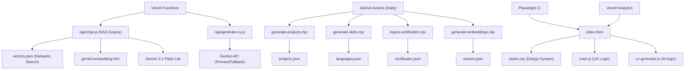

<div align="center">

# 🚀 Julio Okuda — AI Automation Portfolio

### *"E se o próprio portfólio fosse a prova de que eu domino IA?"*

<br>

<!-- 👇 Substitua pelo GIF do site em funcionamento -->


<br>

[](https://portfolio-jcnok.vercel.app/)

<br>

[](https://vercel.com/new/clone?repository-url=https%3A%2F%2Fgithub.com%2FJcnok%2Fportfolio)
[](https://linkedin.com/in/juliookuda)
[](https://opensource.org/licenses/MIT)
[](https://html.spec.whatwg.org/)
[](https://www.w3.org/Style/CSS/)
[](https://developer.mozilla.org/en-US/docs/Web/JavaScript)
[](https://ai.google.dev/)

</div>

---

## 📋 Índice

- [A História por Trás](#-a-história-por-trás)
- [Funcionalidades](#-funcionalidades)
- [Destaque: Chat RAG Inteligente](#-destaque-chat-rag-inteligente)
- [Destaque: Gerador de Currículo IA (ATS)](#-destaque-gerador-de-currículo-ia-ats)
- [Arquitetura do Projeto](#️-arquitetura-do-projeto)
- [Stack Tecnológico](#-stack-tecnológico)
- [Pipeline de Automação](#-pipeline-de-automação)
- [Estrutura de Arquivos](#-estrutura-de-arquivos)
- [Como Executar Localmente](#-como-executar-localmente)
- [Variáveis de Ambiente](#-variáveis-de-ambiente)
- [Qualidade e Testes](#-qualidade-e-testes)
- [Padrões de Engenharia](#-padrões-de-engenharia)
- [Roadmap](#-roadmap)
- [Contato](#-contato)
- [Licença](#-licença)

---

## 💡 A História por Trás

> *A maioria dos portfólios são vitrines. Este é uma plataforma de engenharia viva.*

Eu poderia ter feito o que todo mundo faz: uma página bonita com cards de projetos e um botão "Baixar CV". Mas isso não reflete quem eu sou.

Sou um profissional em **transição de carreira para IA e Automação**, e meu portfólio precisava responder uma pergunta simples: **"Ele realmente sabe fazer o que diz?"**

A resposta está na própria experiência de navegação:

- O **Chat com RAG** responde perguntas sobre mim usando Retrieval-Augmented Generation — buscando provas reais nos meus 56+ repositórios e certificados.
- O **Gráfico de Habilidades** é gerado automaticamente a partir dos meus repositórios do GitHub via pipeline diária.
- O **Gerador de Currículo ATS** analisa vagas em tempo real e monta um dossiê personalizado cruzando com meus dados reais.
- **Engenharia de Conversão**: O site monitora engajamento (Vercel Analytics) e facilita o agendamento direto via Calendly/WhatsApp.

Cada feature deste site é uma **demonstração técnica viva** das habilidades que eu listo no meu currículo. Não é buzzword — é código em produção, testado e monitorado.

---

## ✨ Funcionalidades

| Feature | Descrição | Tech |
|---|---|---|
| 🧠 **Chat RAG** | Assistente com Retrieval-Augmented Generation — busca em 56+ repos e certificados para respostas com fontes verificáveis | Gemini Embedding, Cosine Similarity, Vercel Functions |
| 🤖 **Gerador de CV ATS** | Analisa vagas e gera Relatório + Currículo + Carta em `.doc` | Gemini 2.5 Flash + Fallback |
| 📊 **Skills Dinâmicas** | Gráfico radar gerado via pipeline GitHub Actions + Gemini | Chart.js, GitHub GraphQL API |
| 🎓 **Ingestão de Certificados** | PDFs do Google Drive → transcrição automática via Gemini Vision | Google Drive API, Gemini Vision |
| 📈 **Telemetria de Leads** | Monitoramento de cliques e conversão em tempo real | Vercel Analytics |
| 🎯 **CTA de Conversão** | Agendamento via Calendly e WhatsApp integrados | Headless JSON Config |
| ✨ **UX Nudges** | Micro-animações (Pulse) que ativam após scroll estratégico | JS Intersection Observer |
| 📱 **Mobile-First** | 100% responsivo com tipografia fluida (`clamp`) | CSS Grid, Clamp Logic |
| 🧪 **Blindagem Técnica** | Testes Unitários (Jest) e End-to-End (Playwright) | Jest, Playwright |

---

## 🧠 Destaque: Chat RAG Inteligente

> *"O chat não inventa. Ele busca provas nos seus projetos reais antes de responder."*

O sistema de chat implementa uma arquitetura **RAG (Retrieval-Augmented Generation)** completa, 100% serverless e sem custos de infraestrutura:

```
┌──────────────────────────────────────────────────────────────────────────┐
│  PIPELINE DIÁRIA (GitHub Actions — 06:00 UTC)                          │
│                                                                        │
│  1. 📂 Busca 56+ repositórios públicos (GraphQL) + READMEs (REST)     │
│  2. 🎓 Ingestão de certificados do Google Drive (Gemini Vision)       │
│  3. 🧠 Gera embeddings com gemini-embedding-001 → vectors.json       │
│  4. 🚀 Commit automático → Vercel auto-deploy                         │
└──────────────────────────────────────────────────────────────────────────┘

┌──────────────────────────────────────────────────────────────────────────┐
│  RUNTIME (Vercel Serverless — cada pergunta do recrutador)             │
│                                                                        │
│  Pergunta → Embedding da query → Cosine Similarity vs vectors.json    │
│  → Top-5 documentos relevantes → Injeção de contexto no System Prompt │
│  → Gemini responde com fontes verificáveis e links clicáveis          │
└──────────────────────────────────────────────────────────────────────────┘
```

### Características Técnicas:
- **Zero-Hallucination**: O LLM só responde com informações presentes nos documentos recuperados.
- **Fontes Clicáveis**: Cada resposta inclui links diretos para os repositórios GitHub citados.
- **Graceful Degradation**: Se o banco vetorial não existir, o chat funciona normalmente sem RAG.
- **Zero-Ops**: Sem banco de dados externo — o `vectors.json` (~4MB) é servido como asset estático.

---

## 🤖 Destaque: Gerador de Currículo IA (ATS)

> *"Recrutador, em vez de entregar um PDF genérico, construí um agente que monta o currículo sob medida para a SUA vaga."*

Esta é a feature que diferencia este portfólio. O sistema funciona assim:

```
┌──────────────┐     ┌──────────────────┐     ┌──────────────────────┐
│  Recrutador  │────▶│  Cole a Vaga no  │────▶│  Gemini 2.5 Flash    │
│  (Browser)   │     │  Modal do Site   │     │  (Temperature = 0)   │
└──────────────┘     └──────────────────┘     └──────────┬───────────┘
                                                         │
                                               ┌──────────▼───────────┐
                                               │  Fallback Automático │
                                               │  Gemini 3.1 Lite     │
                                               └──────────┬───────────┘
                                                         │
                      ┌───────────────────────────────────▼─┐
                      │         3 Outputs Separados          │
                      │                                      │
                      │  📊 Relatório de Compatibilidade     │
                      │  📄 Currículo ATS (.doc)             │
                      │  ✉️  Carta de Apresentação (.doc)     │
                      └──────────────────────────────────────┘
```

### Características Técnicas:
- **Zero-Hallucination**: Perfil embutido estaticamente no System Prompt.
- **Dual-Model Fallback**: Migração automática entre modelos se atingir Rate Limits.
- **Exportação Nativa**: Arquivos `.doc` gerados via Blob com wrapper XML do MS Office.

---

## 🏗️ Arquitetura do Projeto


```mermaid
graph TD;
    A["index.html"]-->B["styles.css (Design System)"]
    A-->C["main.js (UX Logic)"]
    A-->H["cv-generator.js (AI logic)"]

    I["Vercel Functions"]-->J["/api/chat.js (RAG Engine)"]
    I-->K["/api/generate-cv.js"]
    J-->VEC["vectors.json (Semantic Search)"]
    J-->EMB["gemini-embedding-001"]
    J-->LLM["Gemini 3.1 Flash Lite"]
    K-->P["Gemini API (Primary/Fallback)"]

    L["GitHub Actions (Daily)"]-->M1["generate-projects.mjs"]
    L-->M2["generate-skills.mjs"]
    L-->M3["ingest-certificates.mjs"]
    L-->M4["generate-embeddings.mjs"]
    M1-->O1["projects.json"]
    M2-->O2["languages.json"]
    M3-->O3["certificates.json"]
    M4-->O4["vectors.json"]

    R["Playwright CI"]-->A
    S["Vercel Analytics"]-->A
```

---

## 🔧 Stack Tecnológico

| Camada | Tecnologias |
|---|---|
| **Frontend** | HTML5 Semântico, Vanilla CSS (Design Tokens), Vanilla JS ES6+ |
| **Inteligência** | Google Gemini (Multi-model), RAG (Embeddings + Cosine Similarity), Vercel Serverless |
| **Dados** | Google Drive API (Certificados), GitHub GraphQL + REST API (Repositórios) |
| **Qualidade** | Playwright (E2E), Jest (Unit), GitHub Actions (CI) |
| **Observabilidade** | Vercel Analytics (Event Tracking) |
| **Automação** | 4 scripts Node.js autônomos (Daily Pipeline), GitHub Actions |

---

## ⚙️ Pipeline de Automação

A pipeline diária roda automaticamente às 06:00 UTC via GitHub Actions:

| Step | Script | Output | Descrição |
|------|--------|--------|-----------|
| 1 | `generate-projects.mjs` | `projects.json` | Busca repos pinados + enriquecimento Gemini |
| 2 | `generate-skills.mjs` | `languages.json` | Analisa bytes de código + gera radar de skills |
| 3 | `ingest-certificates.mjs` | `certificates.json` | Transcreve PDFs do Google Drive via Gemini Vision |
| 4 | `generate-embeddings.mjs` | `vectors.json` | Gera embeddings de 56+ repos + certificados |
| 5 | Auto-commit | `git push` | Vercel auto-deploy com dados atualizados |

---

## 📁 Estrutura de Arquivos

```
portfolio/
├── api/                          # Vercel Serverless Functions
│   ├── chat.js                   # Chat RAG Engine (v3.0)
│   └── generate-cv.js            # Gerador de CV ATS
├── assets/
│   ├── css/styles.css            # Design System completo
│   ├── data/                     # Headless CMS (JSON)
│   │   ├── config.json           # Configuração centralizada (Calendly, WhatsApp)
│   │   ├── projects.json         # Projetos pinados (auto-generated)
│   │   ├── languages.json        # Skills radar (auto-generated)
│   │   ├── certificates.json     # Certificados transcritos (auto-generated)
│   │   ├── vectors.json          # Banco vetorial RAG (auto-generated)
│   │   └── experience.json       # Experiência profissional
│   └── js/                       # Módulos JavaScript
│       ├── main.js               # UX, animações, navegação
│       ├── chat.js               # Chat widget (RAG sources UI)
│       ├── cv-generator.js       # Lógica do gerador de CV
│       ├── projects.js           # Renderização de cards
│       └── skills-chart.js       # Gráfico radar (Chart.js)
├── scripts/                      # Pipelines autônomos
│   ├── generate-projects.mjs     # GitHub Pinned → projects.json
│   ├── generate-skills.mjs       # GitHub Languages → languages.json
│   ├── ingest-certificates.mjs   # Google Drive PDFs → certificates.json
│   └── generate-embeddings.mjs   # All Repos + Certs → vectors.json
├── docs/                         # Documentação AIOX
│   ├── prd.md                    # Product Requirements Document
│   ├── stories/                  # User Stories por Epic
│   └── design-system-lite.md     # Design tokens e guidelines
├── tests/                        # Testes automatizados
│   ├── unit/                     # Jest (lógica de dados)
│   └── e2e/                      # Playwright (fluxo de conversão)
├── .github/workflows/            # CI/CD
│   ├── ci.yml                    # Build + Testes no PR/Push
│   └── update-projects.yml       # Pipeline diária (Daily Data)
└── index.html                    # Entry point
```

---

## 🚀 Como Executar Localmente

### 1. Clone e instale
```bash
git clone https://github.com/Jcnok/portfolio.git
cd portfolio
npm install
```

### 2. Configure as variáveis de ambiente
```bash
cp .env.example .env
# Preencha as variáveis necessárias (ver seção abaixo)
```

### 3. Inicie o servidor
```bash
npx serve .
```

### 4. Rode os testes
```bash
# Testes Unitários
npm test

# Testes E2E
npx playwright install
npx playwright test
```

---

## 🔐 Variáveis de Ambiente

| Variável | Obrigatória | Descrição |
|----------|:-----------:|-----------|
| `GEMINI_API_KEY` | ✅ | Chave da API Google AI Studio ([obter aqui](https://aistudio.google.com/apikey)) |
| `GITHUB_TOKEN` | ✅ | Token GitHub com escopo `public_repo` ([criar aqui](https://github.com/settings/tokens)) |
| `GOOGLE_SERVICE_ACCOUNT_KEY` | 📋 Pipeline | JSON da Service Account do Google Cloud |
| `GOOGLE_DRIVE_FOLDER_ID` | 📋 Pipeline | ID da pasta do Drive com certificados em PDF |

> As variáveis 📋 são necessárias apenas para a pipeline de ingestão (GitHub Actions).

---

## 🧪 Qualidade e Testes (Quality Gates)

Para garantir que a experiência do recrutador seja sempre perfeita, implementamos:
1. **Jest**: Valida a lógica de filtragem de projetos e manipulação de dados JSON.
2. **Playwright**: Simula um usuário real navegando no site, abrindo o modal de IA e clicando nos CTAs de contato.
3. **CI Pipeline**: Bloqueia o deploy caso qualquer teste quebre, mantendo a integridade 100% do tempo.

---

## 📐 Padrões de Engenharia

- **Story-Driven Development**: Cada feature segue o ciclo PRD → Epic → Story → Implementation → Done.
- **Headless CMS**: Todos os dados dinâmicos vivem em `assets/data/*.json`, sem CMS externo.
- **Zero-Ops**: Nenhuma infraestrutura paga — Google Free Tier + Vercel Free + GitHub Actions.
- **Graceful Degradation**: Features de IA falham silenciosamente sem afetar a navegação base.
- **Conventional Commits**: Mensagens semânticas (`feat:`, `fix:`, `docs:`, `chore:`).
- **AIOX Framework**: Documentação e desenvolvimento orientados por agentes especializados.

---

## 🔮 Roadmap

- [x] Chat com IA (Gemini)
- [x] Pipeline automática de Skills (GitHub Actions)
- [x] Gerador de Currículo ATS com Dual-LLM
- [x] Engenharia de Conversão (Analytics + CTAs)
- [x] Testes E2E (Playwright) + CI/CD
- [x] Headless Config (Centralizado em JSON)
- [x] **RAG Engine — Chat com busca vetorial em 56+ repos e certificados**
- [x] **Ingestão automática de certificados do Google Drive**
- [x] **Embeddings com `gemini-embedding-001` (Zero-Ops)**
- [ ] Blog integrado com IA
- [ ] Internacionalização (EN/PT)
- [ ] Progressive Web App (PWA)

---

## 📞 Contato

<div align="center">

| Canal | Link |
|---|---|
| 💼 **LinkedIn** | [linkedin.com/in/juliookuda](https://linkedin.com/in/juliookuda) |
| 📅 **Agendar Café** | [Calendly](https://calendly.com/jcnok) |
| 📧 **Email** | [julio.okuda@gmail.com](mailto:julio.okuda@gmail.com) |
| 🌐 **Portfólio** | [portfolio-jcnok.vercel.app](https://portfolio-jcnok.vercel.app/) |

</div>

---

## 📄 Licença

Este projeto está sob a licença [MIT](https://opensource.org/licenses/MIT).

---

<div align="center">

**Desenvolvido com ❤️ e IA por [Julio Cesar Okuda](https://github.com/Jcnok)**

*"Não é apenas um portfólio. É a prova de conceito do seu próximo projeto."*

</div>
